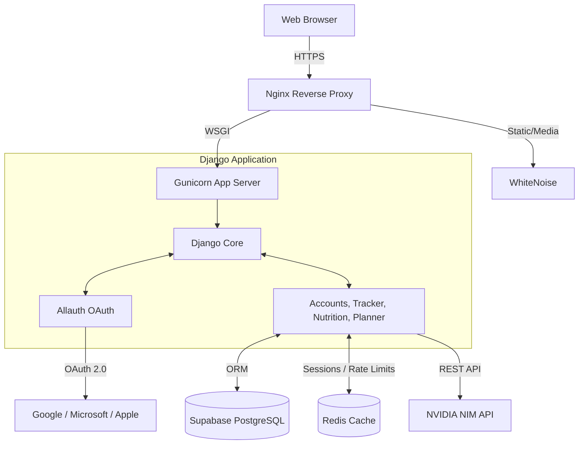

# 🏋️‍♂️ FitForge


**FitForge** is a production-ready, AI-powered fitness and nutrition planner. Instead of static workout routines, FitForge leverages the NVIDIA NIM API (Llama 3 70B) to generate highly personalized, dynamically adapting training blocks and macro-nutrient diets based on your unique body metrics, goals, and equipment availability.

---

## ✨ Features

- **AI-Powered Planning**: Generates comprehensive 7-day workout and diet plans.
- **Social Authentication**: Seamless login with Google, Microsoft, and Apple via `django-allauth`.
- **Dynamic BMI Calculator**: Interactive, real-time BMI gauge and historical tracking.
- **Progress Tracking**: Log your daily workouts, weights, and meals.
- **Macro Calculation**: Automatically computes your TDEE and macro splits.
- **Dark/Gold Aesthetic**: Premium industrial design system.
- **Supabase Integration**: Uses Supabase PostgreSQL for high-performance, secure data storage.
- **Rate Limiting & Security**: Production-hardened with Redis caching, request limits, and HSTS.

---

## 🏗 Architecture



---

## 🛠 Tech Stack

| Category | Technology |
|---|---|
| **Backend Framework** | Django 4.2 |
| **Database** | Supabase (PostgreSQL) |
| **Caching & Sessions** | Redis |
| **AI Integration** | NVIDIA NIM API (Llama 3 70B) |
| **Authentication** | `django-allauth` (Google, MS, Apple) |
| **Frontend** | HTML5, Vanilla CSS, Bootstrap 5, Chart.js, AOS |
| **Deployment** | Docker, Docker Compose, Gunicorn, Nginx |

---

## 🚀 Quick Start (Local Development)

### 1. Clone & Setup Environment

```bash
git clone https://github.com/yourusername/fitforge.git
cd fitforge
python -m venv venv
source venv/bin/activate  # On Windows: venv\Scripts\activate
pip install -r requirements.txt
```

### 2. Configure Environment Variables

Copy the example env file and fill in your keys:

```bash
cp .env.example .env
```

Ensure you have a valid [NVIDIA API Key](https://build.nvidia.com/) for the AI planner to work.

### 3. Setup Database (Local SQLite for dev)

```bash
python manage.py migrate
```

### 4. Load Demo Data (Optional)

```bash
# This will load a demo user, past workouts, BMI logs, and meals
python manage.py loaddata demo_data
```
*Demo User credentials: `demo@fitforge.app` / `FitForge123!`*

### 5. Run Server

```bash
# Terminal 1: Run Redis (requires Docker or local installation)
docker run -p 6379:6379 -d redis:7

# Terminal 2: Run Django
python manage.py runserver
```

Visit `http://localhost:8000`.

---

## 🐳 Docker Production Deployment

1. Ensure `.env` is configured with `DATABASE_URL` pointing to your Supabase project.
2. Build and run the containers:

```bash
docker-compose up --build -d
```

3. Run migrations inside the container:

```bash
docker-compose exec web python manage.py migrate
```

---

## 🧪 Testing

FitForge includes a comprehensive test suite covering models, views, forms, and utility functions.

```bash
# Run all tests
python manage.py test

# Run tests with verbosity
python manage.py test --verbosity=2
```

---

## 🔑 Environment Variables Reference

| Variable | Description | Required | Default |
|---|---|---|---|
| `SECRET_KEY` | Django secret key | Yes | - |
| `DEBUG` | Enable debug mode | No | `False` |
| `DATABASE_URL` | Supabase Postgres URL | Yes (Prod) | SQLite fallback |
| `REDIS_URL` | Redis connection string | Yes | `redis://localhost:6379/0` |
| `NVIDIA_API_KEY` | NVIDIA NIM API Key | Yes | - |
| `GOOGLE_CLIENT_ID` | Google OAuth ID | No | - |
| `MICROSOFT_CLIENT_ID` | Azure App ID | No | - |

---

## 📄 License

This project is licensed under the MIT License — see the [LICENSE](LICENSE) file for details.
